# LLMOps Platform — System Architecture

**Version:** 1.0  
**Date:** 2026-06-12  
**Author:** sirfenrir  
**Audience:** Mentor / Evaluator

---

## Table of Contents

1. [Platform Overview](#1-platform-overview)
2. [AWS Infrastructure Layer](#2-aws-infrastructure-layer)
3. [GitOps & Deployment Layer](#3-gitops--deployment-layer)
4. [LLM Gateway — LiteLLM](#4-llm-gateway--litellm)
5. [Application Services](#5-application-services)
6. [Observability Stack](#6-observability-stack)
7. [Security & Governance](#7-security--governance)
8. [Traffic Simulation & Chaos Testing](#8-traffic-simulation--chaos-testing)
9. [Architecture Tradeoffs & Decisions](#9-architecture-tradeoffs--decisions)

---

## 1. Platform Overview

This platform provides a secure, observable, and cost-governed internal LLM service for a ~290-person engineering organisation. Employees interact through a web chat UI; all LLM traffic flows through a centralised proxy gateway before reaching any external model provider.

**Five core design goals:**

| Goal | Implementation |
|---|---|
| Internal-only access | All services exposed only via internal AWS ALB; no public endpoints |
| Provider abstraction | Model aliases hide provider details; users never see raw model names |
| Cost governance | Per-team monthly budgets and rate limits enforced at the gateway |
| Full observability | LLM traces (Langfuse), infra metrics (Prometheus/Grafana), logs (Loki) |
| GitOps operations | All configuration in Git; ArgoCD continuously reconciles cluster state |

**Top-level architecture zones:**

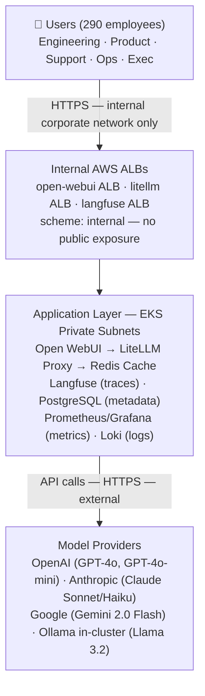

---

## 2. AWS Infrastructure Layer

### 2.1 Terraform Layering Strategy

Infrastructure is provisioned in three sequential Terraform layers, each storing state independently in S3 (`llmops-tfstate-492`). This separation means a change to the application layer (secrets, IAM) does not risk destroying the VPC or EKS cluster.

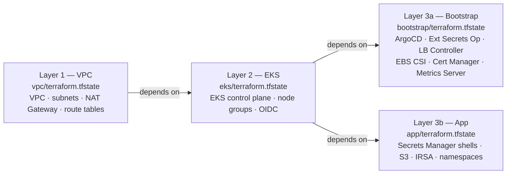

**Why this layering:** Layers 1 and 2 are long-lived and expensive to recreate. Separating them from Layer 3 allows iterating on application infrastructure without touching the network foundation.

### 2.2 Network Topology

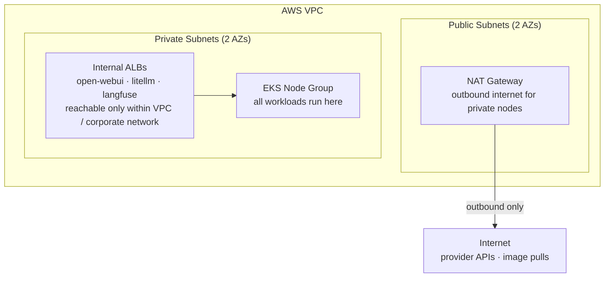

**Key decision — no public nodes:** EKS worker nodes sit entirely in private subnets. They reach the internet (for image pulls, provider API calls) via NAT Gateway. No node has a public IP. This prevents direct ingress to any pod.

### 2.3 EKS Bootstrap Add-ons

| Add-on | Purpose |
|---|---|
| AWS Load Balancer Controller | Provisions internal ALBs from Kubernetes Ingress resources |
| External Secrets Operator | Syncs AWS Secrets Manager values into Kubernetes Secrets |
| ArgoCD | GitOps controller — reconciles cluster state from Git |
| EBS CSI Driver | Provides `gp3` persistent volumes for PostgreSQL, ClickHouse |
| Cert Manager | TLS certificate management |
| Metrics Server | Enables HPA (CPU/memory autoscaling) |

### 2.4 IRSA (IAM Roles for Service Accounts)

Pods access AWS services (Secrets Manager, S3) without static credentials by assuming IAM roles bound to their Kubernetes service accounts via OIDC federation. Langfuse uses IRSA to write trace blobs to S3. External Secrets Operator uses IRSA to read from Secrets Manager.

---

## 3. GitOps & Deployment Layer

### 3.1 ArgoCD App-of-Apps Pattern

A single root ArgoCD Application (`argocd/root-app.yaml`) watches `argocd/apps/` in Git. Each file in that directory is itself an ArgoCD Application pointing to a Helm chart with values from `argocd/helm-values/`. This gives one entry point that manages the entire platform.

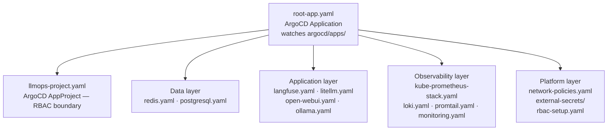

**Sync policy:** `automated.prune=true` + `selfHeal=true`. If someone manually changes a resource in the cluster, ArgoCD reverts it within seconds. If a resource is removed from Git, ArgoCD deletes it from the cluster.

### 3.2 Namespace Design

| Namespace | Contents |
|---|---|
| `litellm` | LiteLLM proxy (3–4 replicas) |
| `langfuse` | Langfuse web + worker + ClickHouse |
| `postgresql` | PostgreSQL (primary + metrics sidecar) |
| `redis` | Redis (master + metrics sidecar) |
| `ollama` | Ollama local model server |
| `open-webui` | Open WebUI (2–5 replicas) |
| `monitoring` | Prometheus, Grafana, Alertmanager |
| `loki` | Loki + Promtail |
| `external-secrets` | External Secrets Operator |
| `argocd` | ArgoCD controllers |

### 3.3 Network Policy Map

NetworkPolicies restrict which namespaces can initiate connections to which. The intent is: only LiteLLM can reach PostgreSQL and Redis directly; Open WebUI can only reach LiteLLM.

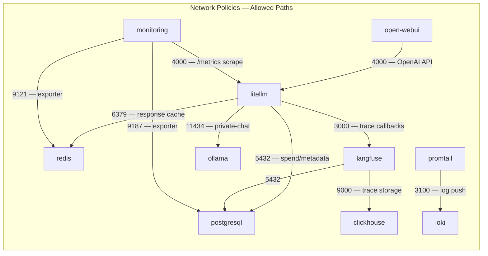

### 3.4 Deployment Timeline (Bootstrap Order)

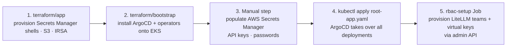

---

## 4. LLM Gateway — LiteLLM

LiteLLM is the single choke point for all LLM traffic. No service — including Open WebUI — calls an external provider API directly.

### 4.1 Model Aliases

Aliases decouple users and apps from provider-specific model identifiers. The alias is stable even if the backing model is swapped.

| Alias | Backing Models | Use Case | Team Access |
|---|---|---|---|
| `fast-chat` | GPT-4o-mini, Gemini 2.0 Flash, Llama 3.2 | General internal chat | All teams |
| `coding-assistant` | Claude Sonnet 4.6, GPT-4o-mini | Code review, debugging | Engineering only |
| `private-chat` | Ollama/Llama 3.2 (in-cluster) | Sensitive internal prompts | Engineering only |
| `long-context` | Gemini 2.0 Flash (1M ctx), GPT-4o (128k) | Large document analysis | Engineering, Executives |
| `fallback-model` | GPT-4o-mini | Last-resort backup | Internal (not user-facing) |

### 4.2 Request Flow (End-to-End)

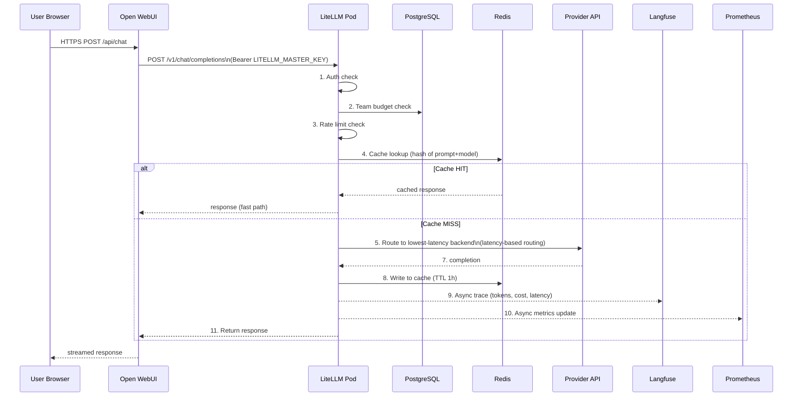

### 4.3 Fallback Chain

If a provider returns errors or times out, LiteLLM retries (2 attempts) then falls back in order:

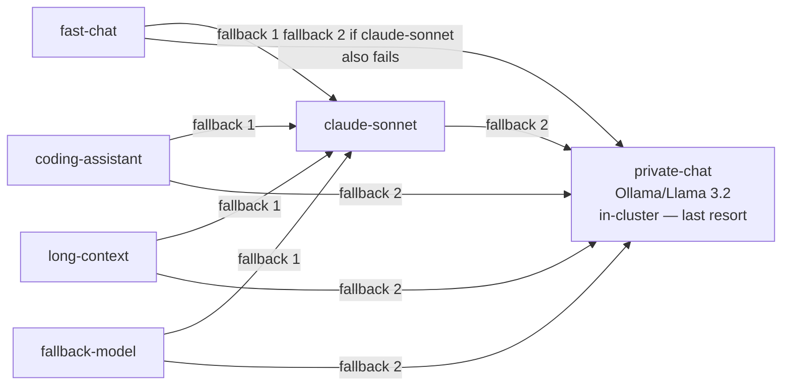

Failing providers enter a 60-second cooldown (`cooldown_time: 60`). A provider that fails 3 times (`allowed_fails: 3`) is temporarily excluded from routing.

### 4.4 Team Budget & Rate Limits

Enforced by the LiteLLM admin API, configured by `argocd/rbac-setup/setup-teams.py`:

| Team | Monthly Budget | RPM Limit | TPM Limit | Allowed Models |
|---|---|---|---|---|
| engineering | $100 | 500 | 500,000 | All aliases |
| support | $40 | 150 | 150,000 | fast-chat |
| product | $30 | 100 | 100,000 | fast-chat |
| operations | $20 | 80 | 80,000 | fast-chat |
| executives | $10 | 50 | 50,000 | fast-chat, long-context |

Platform-wide limit: 1,000 RPM / 1,000,000 TPM / $6,000/month.

### 4.5 Caching

Redis stores LiteLLM response cache with a 1-hour TTL. Cache key is derived from the prompt content + model alias. The 2% duplicate-prompt rate in the traffic simulator is designed to exercise and validate this path. If Redis is unavailable, LiteLLM degrades gracefully — requests continue without caching.

### 4.6 Sensitive Data Handling

- `redact_messages_in_exceptions: true` — prompt content cannot leak via tracebacks
- `turn_off_message_logging: false` — Langfuse retains full traces (admin-only access)
- `redact_user_api_key_info: false` — virtual key hash + team ID flow to Langfuse for attribution
- Regex guardrails (PII masking pre-call) are configured but currently disabled pending LiteLLM version support for `guardrail: regex` type

---

## 5. Application Services

### 5.1 Open WebUI

ChatGPT-style web interface. Configured to speak the OpenAI-compatible API to LiteLLM — it has no direct knowledge of any model provider.

- **Endpoint:** `http://litellm.litellm.svc.cluster.local:4000/v1`
- **Auth:** `LITELLM_MASTER_KEY` from Kubernetes secret
- **Replicas:** 2 minimum, scales to 5 via HPA (CPU 70% / Memory 80%)
- **No pipelines, no built-in Ollama** — both disabled; LiteLLM handles routing entirely

### 5.2 Langfuse

LLM observability platform. Receives async callbacks from LiteLLM after every request.

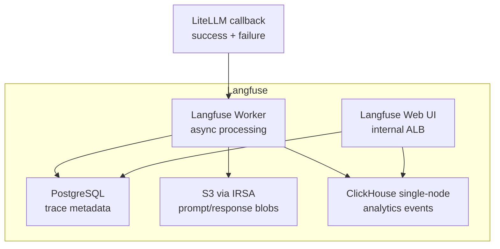

**ClickHouse note:** Single-node deployment with `CLICKHOUSE_CLUSTER_ENABLED=false`. This disables `ON CLUSTER` DDL so migrations use `MergeTree` instead of `ReplicatedMergeTree`, which would hang on a single-keeper setup.

**Trace fields captured:** `user_id`, `team`, `model`, `prompt_tokens`, `completion_tokens`, `total_cost`, `latency_ms`, `status`, `error_message`, `trace_id`.

### 5.3 Ollama (Private Chat — Optional Challenge)

In-cluster model serving for the `private-chat` alias. This was the chosen optional challenge: a local/private model backend for sensitive internal prompts.

- Runs `llama3.2` model inside the cluster
- No prompt data ever leaves the VPC for `private-chat` requests
- Used as final fallback for all aliases when cloud providers fail
- RPM limited to 10 (GPU/CPU-constrained), timeout 300s

**Why this choice:** Satisfies both the optional "private model" requirement and provides a genuine last-resort fallback that keeps the platform functional during cloud provider outages.

### 5.4 Redis

LiteLLM response cache. Single master with metrics sidecar.

- Cache key: hash(prompt + model alias)
- TTL: 3600 seconds (1 hour)
- Graceful degradation: LiteLLM continues if Redis is unreachable

### 5.5 PostgreSQL

Shared database for LiteLLM spend tracking and Langfuse metadata.

- LiteLLM uses it for: virtual key records, team budget spend, request logs
- Langfuse uses it for: project/user metadata, trace index
- Bitnami chart with primary + metrics exporter sidecar
- Password injected via External Secret; DATABASE_URL constructed inline at runtime to avoid drift on rotation

---

## 6. Observability Stack

Three pillars cover different failure modes — none of the three alone gives the complete picture.

| Pillar | Tool | What it catches that others miss |
|---|---|---|
| LLM Traces | Langfuse | Prompt content, per-request cost, per-user attribution, model quality |
| Infrastructure Metrics | Prometheus + Grafana | CPU/memory pressure, pod restarts, queue depth, provider error rates |
| Application Logs | Loki + Promtail | Error stack traces, provider timeout messages, request IDs for correlation |

### 6.1 Metrics (Prometheus + Grafana)

ServiceMonitors scrape:
- `litellm:4000/metrics` — request counts, error rates, per-provider latency histograms
- `redis:9121/metrics` — memory usage, evictions, connection count
- `postgresql:9187/metrics` — connections, slow queries, storage

**Key Grafana dashboard panels:**

| Panel | Query | SLO |
|---|---|---|
| Request rate | `rate(litellm_deployment_total_requests_total[5m])` | — |
| Error rate | failure / total requests | < 2% |
| P95 Latency | `histogram_quantile(0.95, ...)` | < 3s |
| Redis memory | used / max bytes | < 80% |
| PostgreSQL connections | connected / max | < 80% |
| Pod restarts | `kube_pod_container_status_restarts_total` | alert on increase |

### 6.2 Observability Flow Diagram

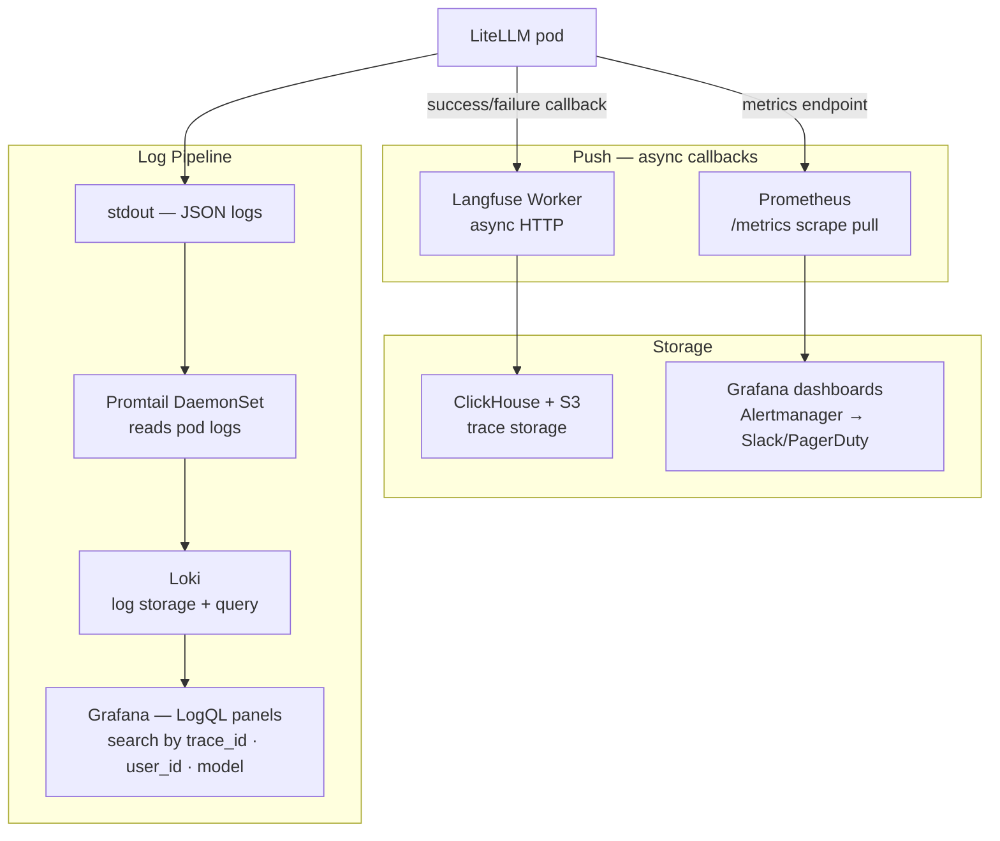

### 6.3 Alerting Rules

| Alert | Condition | Severity | Delay |
|---|---|---|---|
| LiteLLMHighErrorRate | error rate > 5% for 5m | critical | 5m |
| LLMProviderHighTimeoutRate | timeout rate > 10% for 5m | warning | 5m |
| OpenWebUIDown | `up == 0` for 2m | critical | 2m |
| LangfuseDown | `up == 0` for 5m | warning | 5m |
| LiteLLMHighLatency | P95 > 3s for 10m | warning | 10m |
| RedisHighMemoryUsage | memory > 80% for 5m | warning | 5m |
| PostgreSQLHighConnections | connections > 80% for 5m | warning | 5m |
| PodCrashLooping | restart count increase | warning | — |

### 6.4 SLO Targets

| Service | SLO |
|---|---|
| Open WebUI availability | 99.5% |
| LiteLLM gateway availability | 99.9% |
| P95 LiteLLM latency (excl. provider) | < 3 seconds |
| LLM request success rate | > 98% |
| Trace ingestion delay | < 60 seconds |
| Error alert detection | < 5 minutes |

---

## 7. Security & Governance

### 7.1 Secret Lifecycle

No secrets are committed to Git. The flow from creation to pod injection:

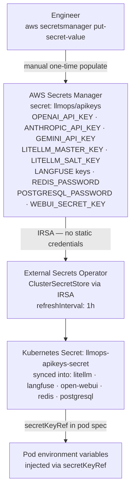

**Secret rotation procedure:** Update the value in AWS Secrets Manager. External Secrets Operator re-syncs within 1 hour (or trigger immediately via annotation). Pods pick up the new value on next restart; LiteLLM's master key rotation requires a rolling restart of the deployment.

### 7.2 Role-Based Model Access

Enforced at the LiteLLM layer via team virtual keys. Each team is created with an explicit `models` allowlist. A request made with a team key for a model not in the allowlist returns HTTP 403.

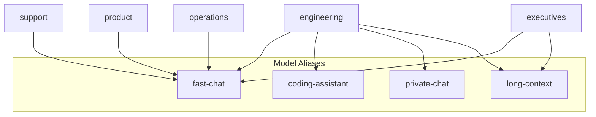

### 7.3 Data Protection

- **Prompt content:** Stored only in Langfuse (admin-only ALB). Not written to Loki/Prometheus.
- **Exceptions:** `redact_messages_in_exceptions: true` prevents prompt leakage in error tracebacks.
- **PII masking:** Regex guardrails (pre-call) configured; currently disabled pending LiteLLM version support. Mitigation: Langfuse access restricted to platform admins.
- **Trace retention:** 30 days (Langfuse). Log retention: 14 days (Loki).
- **Separation:** Operational logs (Loki) contain only request metadata — user_id, model alias, latency, status. Prompt content is isolated in Langfuse.

### 7.4 Network Security

- All application namespaces have NetworkPolicies denying all ingress by default; only explicitly allowed paths are open (see Section 3.3).
- No pod has a public IP.
- LiteLLM is the only service authorised to call external provider APIs.

---

## 8. Traffic Simulation & Chaos Testing

### 8.1 Traffic Simulator

`argocd/traffic-simulator/simulator.py` runs as a Kubernetes CronJob. It models 290 users across 5 teams sending realistic prompts to LiteLLM.

**Base load:** 100 req/min during working hours.

**Burst windows (SGT):**
- 10:00–10:30 → 1,000 req/min (incident simulation)
- 15:00–15:20 → 1,000 req/min (afternoon surge)

**Traffic injection types:**

| Type | Rate | Purpose |
|---|---|---|
| Long-context prompts | 5% | Test `long-context` alias with large payloads |
| Duplicate prompts | 2% | Validate Redis cache hit rate |
| Provider failure simulation | 3% | Trigger fallback chain |
| Expensive-model requests | 15% | Stress-test budget enforcement |
| Sensitive prompts (fake PII/secrets) | 1% | Validate masking and detection alerts |
| Engineering team misuse | Optional | Simulate one team using `coding-assistant` for all requests |

### 8.2 Chaos Scenarios

| Failure | How Injected | Expected Platform Behaviour |
|---|---|---|
| Primary provider timeout | Traffic simulator sets `provider_fail_rate=0.03` | LiteLLM retries (×2) then falls back to next alias backend |
| Redis unavailable | `kubectl delete pod -n redis` | Chat continues; cache misses increase latency; Redis alert fires |
| Langfuse unavailable | `kubectl delete pod -n langfuse` | Chat continues; traces lost during outage; Langfuse alert fires |
| One Open WebUI pod crashes | `kubectl delete pod` (one of two) | Remaining pod serves traffic; availability stays above 99.5% |
| One LiteLLM pod crashes | `kubectl delete pod` (one of three) | Remaining pods serve traffic; PDB ensures min 1 available |
| PostgreSQL connection pressure | Traffic simulator burst window | PG connection alert fires before connections reach max |

### 8.3 Degraded Mode Guarantees

- **Langfuse down:** LiteLLM's `failure_callback: ["langfuse"]` fires but does not block the response path. Users see no impact; traces are lost for the outage window.
- **Redis down:** LiteLLM skips cache; requests pass through to providers. Higher latency and cost but no errors.
- **One provider down:** Fallback chain activates. If all cloud providers fail, `private-chat` (Ollama) remains available.

---

## 9. Architecture Tradeoffs & Decisions

### 9.1 Why LiteLLM (vs. custom proxy / raw provider SDKs)

LiteLLM provides model aliasing, fallback chains, budget enforcement, rate limiting, Redis caching, and dual Langfuse/Prometheus callbacks out of the box. Building equivalent functionality from scratch would take weeks and introduce more surface area for bugs. The tradeoff is tight coupling to LiteLLM's release cadence — upgrading requires re-validating the config (e.g., the regex guardrail feature is deferred exactly because of this).

### 9.2 Why Open WebUI (vs. building a custom chat UI)

Open WebUI is a production-grade, actively maintained chat interface that speaks the OpenAI-compatible API natively. It handles session management, streaming responses, multi-model switching, and user authentication out of the box. Building an equivalent internal UI from scratch would divert significant effort from the platform infrastructure — and Open WebUI's configurable `OPENAI_BASE_API_URL` means it points at LiteLLM with a single environment variable change, keeping the gateway as the sole path to providers.

### 9.3 Why Langfuse (vs. Prometheus-only tracing)

Prometheus counters track *how many* requests succeeded or failed. Langfuse tracks *what was in them*: prompt content, response quality, per-user cost attribution, token breakdowns. These are different data types. Prometheus cannot store prompt text; Langfuse cannot replace time-series alerting. Both are needed.

### 9.4 Why ArgoCD App-of-Apps (vs. Helm push from CI)

Push-based CI creates invisible drift — if someone manually patches a pod, CI won't notice until the next deploy. ArgoCD's self-healing loop (`selfHeal: true`) reverts unauthorised changes within seconds. The App-of-Apps pattern means a single `kubectl apply -f root-app.yaml` bootstraps the entire platform from a fresh cluster.

### 9.5 Why Ollama In-Cluster (Optional Challenge Choice)

The optional challenge was to add a local/private model backend. Ollama was chosen over vLLM because it runs on CPU (no GPU node required for a dev/demo cluster) and supports Llama 3.2 with minimal configuration. The in-cluster placement means the `private-chat` alias processes sensitive prompts entirely within the VPC — no data leaves AWS. As a bonus, Ollama serves as the final fallback for all aliases, keeping the platform functional even during a complete cloud provider outage.

### 9.6 Known Limitations & Production Improvement Recommendations

| Limitation | Production Recommendation |
|---|---|
| Regex guardrails disabled (LiteLLM version gap) | Pin to a LiteLLM release that supports `guardrail: regex`; re-enable the commented config |
| Single-AZ ClickHouse | Migrate to ClickHouse Cloud or a multi-replica deployment for trace durability |
| OIDC/SSO for Open WebUI not implemented | Integrate with corporate IdP (Okta, Google Workspace) using Open WebUI's OIDC support |
| Ollama on CPU only | Add GPU node group for faster private-chat inference at scale |
| Secret rotation is manual | Automate rotation with AWS Lambda + Secrets Manager rotation schedule |
| No distributed tracing (X-Ray / OTEL) | Add OpenTelemetry collector to correlate traces across LiteLLM, Langfuse, and application layers |
| Static LiteLLM team setup via Job | Move team provisioning to Terraform or a GitOps-managed operator to make it fully declarative |
